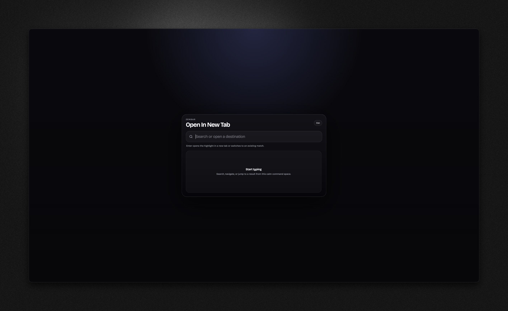

# Zenbar

Zenbar is a Chromium extension that opens a centered command bar for navigation, search, and tab switching.

It is designed to feel closer to a native browser command surface than a traditional extension popup:

- edit the current tab URL or search in the current tab
- open searches in a new tab
- switch between open tabs in the current window
- blend results from tabs, bookmarks, history, and optional DuckDuckGo suggestions



## Features

### Modes

Zenbar currently supports three modes:

- **Current Tab** — prefill the current URL, then navigate or search in the same tab
- **Open In New Tab** — search or open a destination in a new tab
- **Tab Search** — fuzzy-search tabs in the **current window** and switch instantly

### Result sources

Depending on settings and granted permissions, Zenbar can surface:

- open tabs
- bookmarks
- history
- optional DuckDuckGo suggestions

### Behaviors

- search execution uses the browser's default search engine
- bookmark and history rows prefer real favicons when available
- tab rows support quick actions such as pin and close
- restricted pages fall back to a standalone extension window when overlay injection is blocked

## Default shortcuts

Defaults may vary by browser or user configuration, but the manifest currently declares:

- `Cmd/Ctrl + L` — open **Current Tab** mode
- `Cmd/Ctrl + T` — open **Open In New Tab** mode
- `Cmd/Ctrl + Shift + A` — open **Tab Search** mode

Shortcut reassignment is handled by the browser's extension shortcuts page.

## Installation

### Load unpacked

Because Zenbar now bundles its source with esbuild, load the built `dist/` folder, not the raw source tree.

1. Install dependencies:
   ```bash
   bun install
   ```
2. Build the extension:
   ```bash
   bun run build
   ```
3. Open your Chromium browser's extensions page
4. Enable **Developer mode**
5. Choose **Load unpacked**
6. Select the `dist/` directory

## Development

### Requirements

- Bun `1.3+`
- Chromium browser with Manifest V3 support

### Commands

Install dependencies:

```bash
bun install
```

Build:

```bash
bun run build
```

Typecheck:

```bash
bun run typecheck
```

Run tests:

```bash
bun test
```

## Project structure

- `src/background/` — service worker and browser-side behavior
- `src/content/` — content bootstrap for page overlays
- `src/ui/` — command surface and options UI code
- `styles/` — shared extension styles
- `ui/` — HTML entry points
- `icons/` — generated extension icon sizes
- `assets/branding/` — source branding assets
- `assets/readme/` — README screenshots and documentation media

## Permissions

Core permissions:

- `activeTab`
- `scripting`
- `storage`
- `tabs`
- `search`

Optional permissions:

- `bookmarks`
- `history`
- `https://duckduckgo.com/*`

## Notes

- Zenbar does **not** replace the browser's native address bar.
- The extension uses custom commands and an injected overlay/window surface.
- Native browser behaviors still vary across Chromium browsers, especially around shortcuts and tab-management capabilities.
